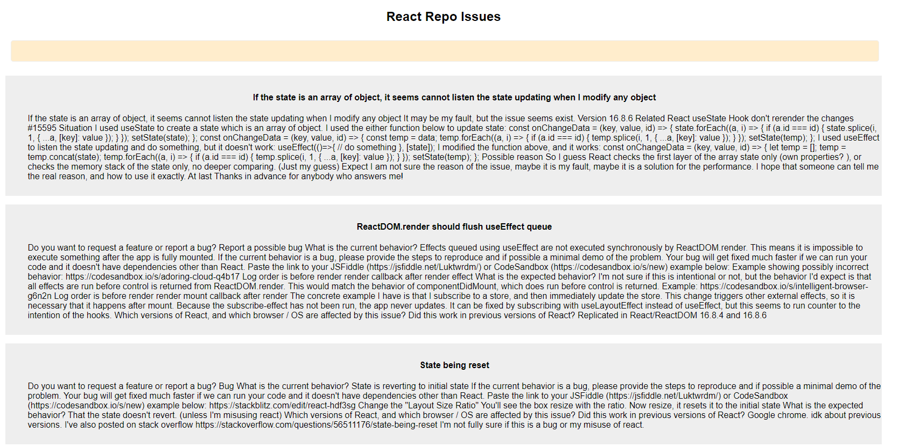
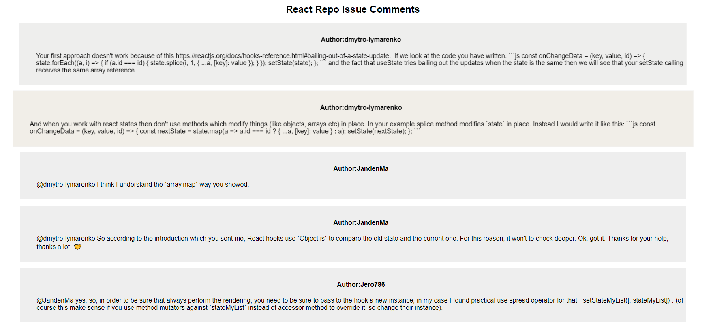

How to Build and run the app:

1) Create config.js and copy config.default.js into a file called config.js, and replace xxx with your username and password.

2) npm install

3) npm start

4) http://localhost:3000/home

## Result

  